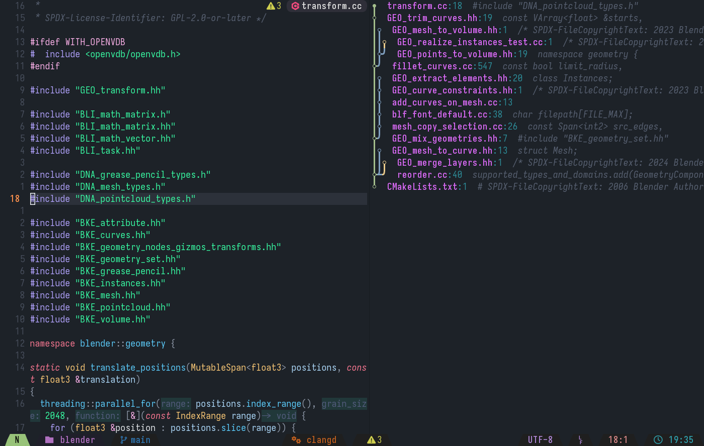
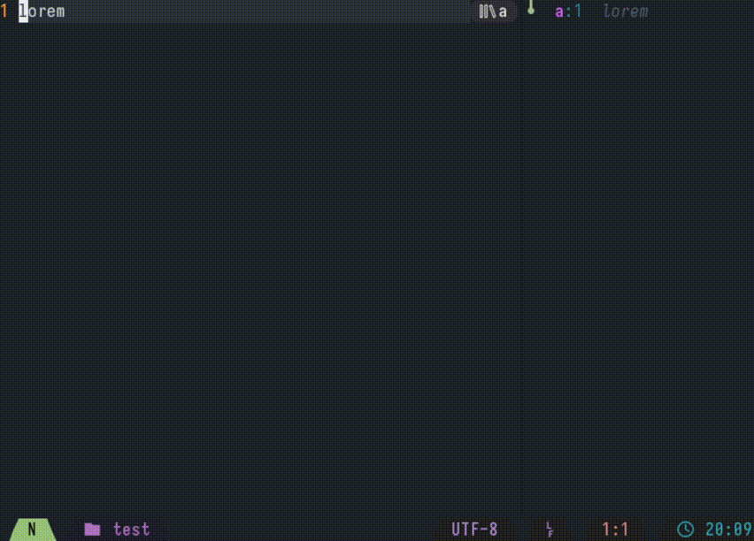

# places.nvim —  The opinionated tree history for NeoVim



**places.nvim** is a plugin that brings a tree-based history to NeoVim.

# Usage

Use `:PlacesTree` to open the history panel.
Inside the history, you can move the cursor over an entry to preview it, then press `Enter` to select it.

When opening a buffer, it is added as a children to the previous buffer.
If you open a buffer while at a former history entry, a branch will be created.

Here's a demo of the plugin in action:


# Installation

**lazy.nvim**
```
{
    "ef3d0c3e/places.nvim"
    lazy = false,
    opts = {},
    keys = {
        -- Confirm history selection
        { "<CR>", function() require("places").buffer.confirm() end, mode = { "n", "x" } },
    }
},
```

Currently, only rendering supports custom options, here are the default options:
```
render = {
	-- Edge characters
	edges = {
		-- Left/Up/Right branch
		LUR = "",
		-- Left/Up branch
		LU = "",
		-- Vertical line
		VERT = "",

		-- Active bottom node
		BOTA = "",
		-- Inactive bottom node
		BOT = "",

		-- Active vertical node
		MIDA = "",
		-- Inactive vertical node
		MID = "",

		-- Active top node
		TOPA = "",
		-- Inactive top node
		TOP = "",

		-- Active branching bottom node
		BOTBA = "",
		-- Inactive branching bottom node
		BOTB = "",

		-- Active vertical branching node
		MIDBA = "",
		-- Inactive vertical branching node
		MIDB = "",

	},
	-- Alternating branch colors
	branch_colors = { "#81a1c1", "#ebcb8b", "#b48ead", "#a3be8c" },

	buffer_name = { fg = "#da6af6", bold = true },
	separator = { fg = "#2d8f9b" },
	line_number = { fg = "#2d8f9b" },
	line_text = { link = "Comment" },

    -- Custom user-provided decoration function
	decorate = nil
}
```

**places.nvim** relies on [branch drawing symbols](https://github.com/kovidgoyal/kitty/pull/7681) which are fairly new.
However, it's possible to use traditional box-drawing characters as replacement:
```
edges = {
    LUR = "┴",
    LU = "┘",
    VERT = "│",
    BOTA = "*",
    BOT = "*",
    MIDA = "*",
    MID = "*",
    TOPA = "*",
    TOP = "*",
    BOTBA = "*",
    BOTB = "*",
    MIDBA = "*",
    MIDB = "*",
},
```

# Public API

Only a single command is registered by default: `PlacesTree`. This command opens the history in a side panel on the right.
You can bind it to a key using `require("places").buffer.open()`

**places.nvim** exposes the following function for your personal configuration:
 - `require("places").buffer.open()` open the tree buffer in a side panel on the right
 - `require("places").buffer.confirm()` replaces the current window with the previewed history entry
 - `require("places").buffer.jump(id)` jumps to the place at index **id**
 - `require("places").buffer.preview(id)` preview the place at index **id** (replace the current window temporarily until `cancel_preview` is called)
 - `require("places").buffer.cancel_preview()` disables the preview

# License

places.nvim is licensed under the MIT license. See [LICENSE](./LICENSE) for more information.
